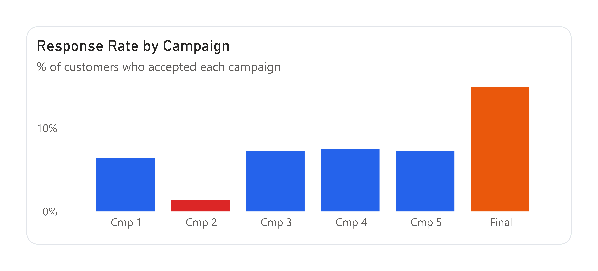
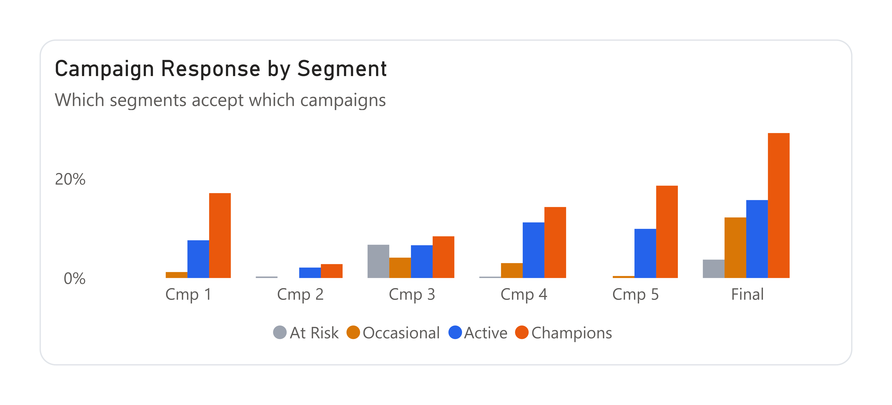
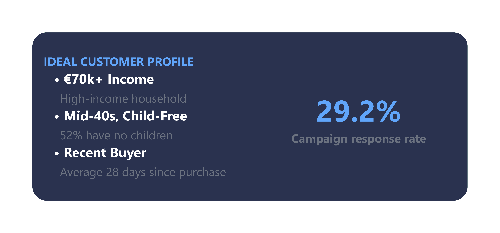
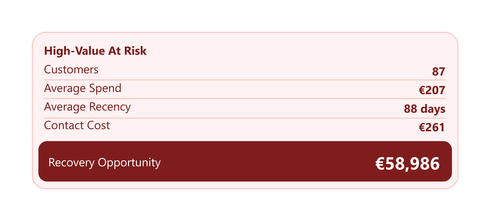
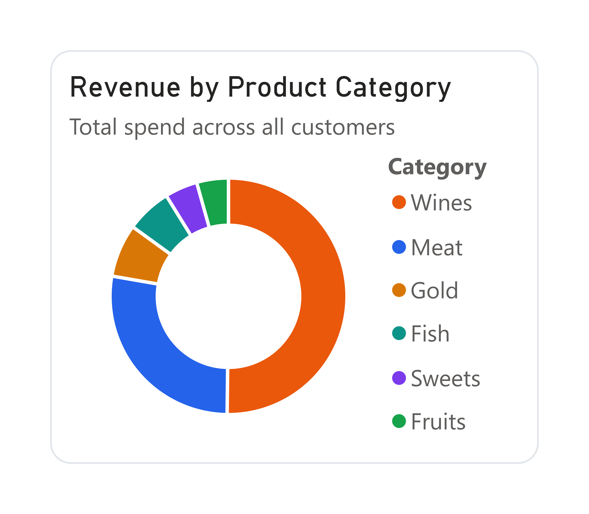
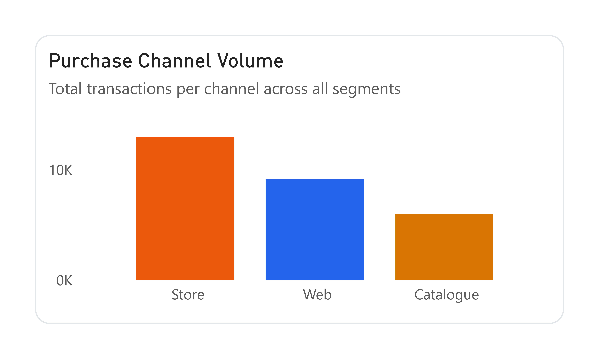

# Marketing Campaign Analysis
**Python · Power BI · Customer Segmentation · Campaign Attribution**

---

## Background & Overview

A retail company with 2,236 customers across 3 purchase channels (Store, Web, Catalogue) and 6 product categories has been running marketing campaigns against its full customer base with little segmentation. This project analyses customer behaviour, campaign performance, and product spend patterns to identify where marketing budget is being wasted and which customers, channels, and campaigns deserve more focus.

The analysis covers five areas:
- Campaign effectiveness across 6 campaigns
- RFM-based customer segmentation
- High-value customer profiling and churn risk
- Channel performance and purchase behaviour
- Product category revenue distribution

Full technical walkthrough: [`notebook/marketing_campaign_analysis.ipynb`](notebook/marketing_campaign_analysis.ipynb)

---

## Data Structure Overview

**Source:** [Customer Personality Analysis – Kaggle](https://www.kaggle.com/datasets/imakash3011/customer-personality-analysis)

Single flat table — 2,236 rows, one row per customer. Key field groups:

| Group | Fields |
|---|---|
| Demographics | `Income`, `Year_Birth`, `Marital_Status`, `Kidhome`, `Teenhome` |
| Product Spend | `MntWines`, `MntMeatProducts`, `MntFruits`, `MntFishProducts`, `MntSweetProducts`, `MntGoldProds` |
| Purchase Channels | `NumWebPurchases`, `NumStorePurchases`, `NumCatalogPurchases`, `NumWebVisitsMonth` |
| Campaign Response | `AcceptedCmp1`, `AcceptedCmp2`, `AcceptedCmp3`, `AcceptedCmp4`, `AcceptedCmp5`, `Response` |
| Recency | `Recency` (days since last purchase), `Dt_Customer` (enrolment date) |

**Engineered features:** `Age`, `TotalSpend`, `TotalPurchases`, `HasChildren`, `Total_Campaign_Accepts`

---

## Executive Summary

Campaign performance across all 6 campaigns averaged a 7.45% response rate, with the final campaign reaching 14.94% — nearly double the average. Despite this, every campaign ran at a net loss when sent to the full customer base, because untargeted contact costs outpace revenue at a 1.34%–7.45% response range. The core problem is not campaign quality — it is audience selection.

RFM segmentation reveals that 537 Champions generate 17× the spend of 600 At Risk customers despite similar group sizes. Champions respond to campaigns at 29%; At Risk customers at 4%. Continuing to contact both groups equally is the primary source of wasted budget.

Within the At Risk segment, 87 high-value customers who have gone dormant represent a €58,986 revenue recovery opportunity at a contact cost of just €261.

---

## Insights Deep Dive

### Campaign Performance

Response rates varied significantly across campaigns, with Campaign 2 performing worst at 1.34% and the final campaign performing best at 14.94%. At €3 per contact across 2,236 customers, each campaign costs €6,708 to run — a cost that only becomes profitable at response rates well above the current average.

Champions drove the majority of responses across all campaigns. The At Risk segment was near-zero for most campaigns but showed relatively higher engagement with Campaign 3 — a signal worth using in future win-back creative.

**Key takeaways:**
- Campaign 2 should be discontinued immediately — 1.34% response, lowest across every segment
- The final campaign's format is the strongest creative signal in the dataset — it lifted response rates across all segments, including Occasional customers jumping from near 0% to 12%
- Every campaign is unprofitable at full-database scale; segmented targeting is the only path to positive ROI

---

### Customer Segments

RFM scoring placed each customer into one of four segments based on Recency, Frequency, and Monetary Value:

| Segment | Customers | Avg Spend | Avg Income | Recency | Has Children | Campaign Response |
|---|---|---|---|---|---|---|
| Champions | 537 | €1,230 | €70,820 | 28 days | 48% | 29% |
| Active | 607 | €886 | €61,922 | 57 days | 65% | 16% |
| Occasional | 492 | €230 | €41,299 | 41 days | 83% | 12% |
| At Risk | 600 | €72 | €33,716 | 67 days | 90% | 4% |

The spend gap between segments is not proportional to size — all four groups contain 490–607 customers, but Champions spend 17× more than At Risk. This makes segment-first targeting the single highest-leverage change available.

**Ideal Customer Profile:** The Champions segment clusters around a high-income (€70k+), child-free profile with a recent purchase (avg 28 days). Campaigns targeting this profile can expect ~29% response rates.

**High Value At Risk:** 87 customers sit in the At Risk segment but carry above-average frequency and spend scores — lapsed Champions with the highest recovery potential. Targeting them costs €261 in contact costs against a €58,986 recovery opportunity if brought back to Active-level spend.

---

### Products & Channels

Wines dominate product revenue at €676k (~50% of all spend). Meat Products are second at €370k. Fruits, Sweets, and Fish combined account for less than 15% of total spend — these categories should be treated as cross-sell additions to wine purchases rather than standalone campaign hooks.

Store is the dominant purchase channel at 12,959 transactions (46%), followed by Web (~9k) and Catalogue (~6k). Champions are disproportionately heavy Catalogue users — consistent with their profile as high-intent, decisive buyers who do not need to browse before purchasing.

Web visits show a counterintuitive negative correlation with spend: customers who visit the website most frequently are the least likely to purchase. The website serves two distinct user types — intent-driven buyers who visit rarely but convert decisively, and browsers who visit frequently but rarely buy. These groups require different retargeting strategies.

---

## Recommendations

| Priority | Action | Expected Impact |
|---|---|---|
| **Immediate** | Discontinue Campaign 2 | Stop wasting €6,630/campaign on a 1.34% response rate |
| **Immediate** | Restrict all future campaigns to Champions + Active segments only | Halve contact costs while targeting the customers who actually respond |
| **Short-term** | Launch recency-triggered win-back for 87 High Value At Risk customers at 60-day dormancy threshold | €58,986 revenue recovery opportunity at €261 contact cost |
| **Medium-term** | Replicate final campaign format across all future campaigns | Highest response rate of any campaign across every segment |
| **Medium-term** | Build a catalogue campaign for Champions featuring Wines & Meat | Matches their purchase channel preference and top spend categories |
| **Strategic** | Develop separate retargeting strategy for high-frequency web visitors who do not convert | Large untapped group currently not served by any campaign type |

---

## Caveats & Assumptions

- **Campaign targeting assumption:** The dataset does not specify which customers were contacted per campaign. All campaign ROI estimates assume the full database was contacted — this is a simplification and should be treated as directional, not exact
- **Revenue proxy:** `Z_Revenue` (€11 per acceptance) and `Z_CostContact` (€3 per contact) are dataset-level constants used as proxies. Actual campaign economics would require real revenue attribution per campaign
- **RFM scoring boundary effects:** Occasional customers show lower average recency than Active customers. This occurs because RFM combines three dimensions — a customer can have low recency but very low frequency and spend, landing them in Occasional rather than Active. The combined score is the correct signal, not any single dimension alone
- **Income outlier:** One customer record showed an income of €666,666 — identified as a data entry error via IQR analysis and removed. The 153k–162k range incomes were retained as plausible high earners
- **Age calculation:** Customer age was calculated relative to the dataset's collection period (2012–2014), not the current date, to avoid artificially inflating ages

---

## Tools & Libraries

| Tool | Usage |
|---|---|
| Python (pandas, numpy) | Data cleaning, feature engineering, RFM scoring |
| Matplotlib / Seaborn | EDA visualisations |
| Jupyter Notebook | End-to-end analysis environment |
| Power BI | Interactive 3-page dashboard |

---

## How to Run

1. Clone the repository
2. Download `marketing_campaign.csv` from [Kaggle](https://www.kaggle.com/datasets/imakash3011/customer-personality-analysis) and place it in the `/data` folder
3. Open `notebook/marketing_campaign_analysis.ipynb` and run all cells
4. Open `dashboard/marketing_dashboard.pbix` in Power BI Desktop — connect to `marketing_campaign_cleaned.csv` if prompted
